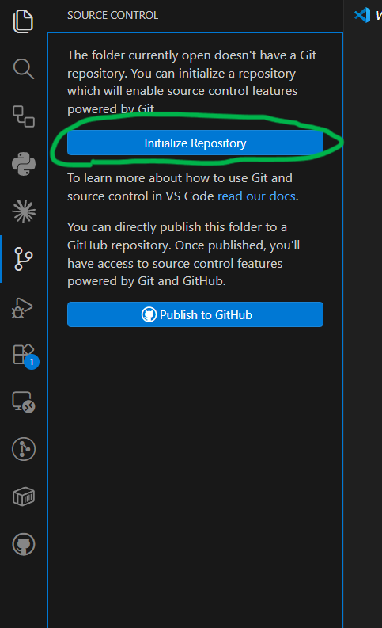
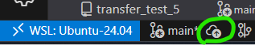
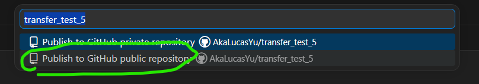
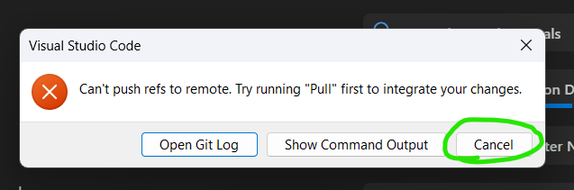
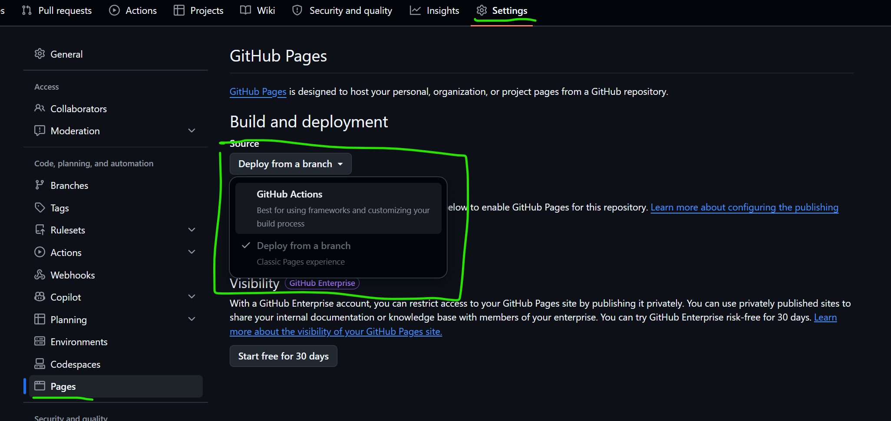
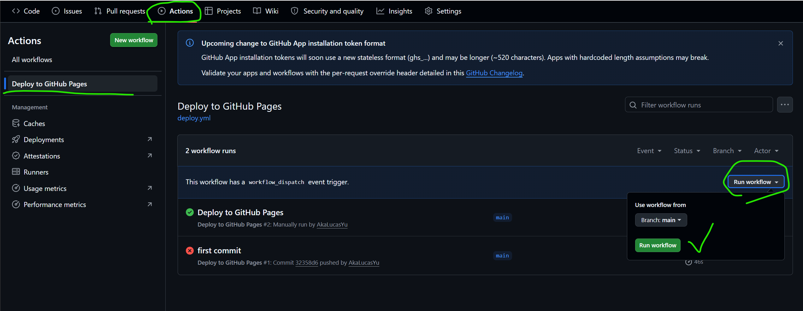

# Project Setup Guide

To setup and deploy this project from the zip archive. Follow the steps below
to publish it to your own GitHub account and get the site running
on GitHub Pages.

**Prerequisites:** Git and a GitHub account. VS Code is recommended for this process.

---

## 1. Extract the zip

Extract the archive and move (or copy) the folder to wherever you
keep your projects.

## 2. Open the project in VS Code

Open the extracted folder in VS Code (**File > Open Folder**).

VS Code will offer to install this project's recommended extensions —
accept. One of them, **YAML** (`redhat.vscode-yaml`), checks the
configuration files as you type and explains each setting on hover. Without
it, a mistake in a config file is not caught until the site is rebuilt.

## 3. Initialize a Git repository

In VS Code, open the **Source Control** tab (the branch icon in the
sidebar) and click **Initialize Repository**.



Or, from the terminal:

```bash
git init
```

## 4. Install Git LFS

This project uses [Git Large File Storage](https://git-lfs.com) for
the `.db` and `.pmtiles` files in `public/`. LFS must be installed
**before your first commit** so these files are stored correctly.

**Windows:**

Download and run the installer from https://git-lfs.com.

**WSL / Linux:**

```bash
sudo apt-get install git-lfs
```

## 5. Initialize Git LFS in the repo

From the VS Code integrated terminal (**Ctrl+`**), or any terminal
open to the project folder:

```bash
git lfs install
```

This only needs to be done once per repo. The `.gitattributes`
file already tells Git which files to track with LFS (`public/*.db`
and `public/*.pmtiles`).

## 6. Publish an empty repository to GitHub

The project includes a GitHub Actions workflow that triggers on push
and deploys to GitHub Pages. Pages must be configured **before the
first push** that contains code, otherwise the workflow will fail.
The easiest way to do this is to publish the repo while it's still
empty, then configure Pages, then commit and push.

Click the publish icon in the VS Code status bar:



VS Code will prompt you to choose a repository name and visibility —
select **Publish to GitHub public repository**:



> **Expected error:** You will likely see a "Can't push refs to
> remote" error. This is normal — the repo was created on GitHub but
> there's nothing to push yet. Click **Cancel** and continue to the
> next step.



## 7. Enable GitHub Pages

**Do this before committing and pushing your code.**

1. Go to your repository on github.com.
2. Open **Settings** (top navigation bar) **> Pages** (left sidebar).
3. Under **Source**, open the dropdown and select **GitHub Actions**.



## 8. Commit and push

Now stage everything, commit, and push. The workflow will run
automatically and deploy the site.

**Option A — VS Code UI:**

1. In the Source Control tab, click **+** (Stage All Changes).
2. Enter a commit message (e.g. `Initial commit`) and click
   **Commit**.
3. Click **Sync Changes** (or **Push**).

**Option B — Terminal:**

```bash
git add -A
git commit -m "Initial commit"
git branch -M main
git push -u origin main
```

## 9. Done

After pushing, the GitHub Actions workflow will build and deploy
the site automatically. Once it finishes (usually 1–2 minutes),
your site will be live at:

```
https://<your-org>.github.io/<your-repo>/
```

Future pushes to `main` will automatically rebuild and redeploy.

If you ever need to re-run the workflow manually, go to the
**Actions** tab and click **Run workflow**:



---

## Troubleshooting

**LFS files not uploading / push rejected for large files:**
Make sure `git lfs install` was run before the first commit. If you
already committed without LFS, you can fix it:

```bash
git lfs install
git lfs migrate import --include="public/*.db,public/*.pmtiles"
git push --force-with-lease
```

**GitHub Actions workflow fails with "resource not accessible by
integration":** Make sure GitHub Pages source is set to
**GitHub Actions** (Step 7), and that the repository is **public**
(or you have a GitHub plan that supports Pages on private repos).

**Site shows a blank page or broken assets:** The deploy workflow
automatically sets the Vite base path to `/<repo-name>/`. If you
renamed the repo after deploying, re-run the workflow from the
Actions tab.
